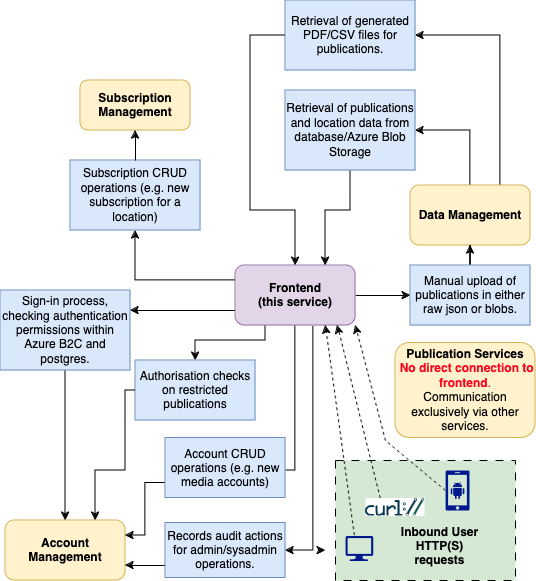

# pip-frontend

# Table of Contents

1. [Overview](#overview)
    1. [Features and functionality](#features-and-functionality)
    2. [Architecture Diagram](#architecture-diagram)
2. [Getting Started](#getting-started)
    1. [Prerequisites](#prerequisites)
        1. [General](#general)
        2. [Nice to haves](#nice-to-haves)
    2. [Installation](#installation)
        1. [Setup](#setup)
        2. [Running the application](#running-the-application)
    3. [Configuration](#configuration)
        1. [Environment Variables](#environment-variables)
            1. [Get environment variables with python scripts](#get-environment-variables-with-python-scripts)
            2. [Runtime secrets](#runtime-secrets)
            3. [Additional test secrets](#additional-test-secrets)
3. [Deployment](#deployment)
4. [Monitoring and Logging](#monitoring-and-logging)
5. [Nunjucks Filters](#nunjucks-filters)
6. [Security & Quality Considerations](#security-and-quality-considerations)
7. [Test Suite](#test-suite)
    1. [Unit tests](#unit-tests)
        1. [Unit tests by type](#unit-tests-by-type)
        2. [Re-running failed tests](#re-running-failed-tests)
    2. [Route Tests](#route-tests)
    3. [Accessibility (a11y) Tests](#accessibility-a11y-tests)
    4. [Functional (E2E) Tests](#functional-e2e-tests)
        1. [Justification for migration to CodeceptJS](#justification-for-migration-to-codeceptjs)
        2. [Running e2e tests](#running-e2e-tests)
8. [Contributing](#contributing)[License](#license)

## Overview

`pip-frontend` is a microservice that serves the frontend of the Court and Tribunal Hearings Service (known as CaTH hereafter). This project was formerly known as the Publications and Information Project within HMCTS.

The frontend uses a [Node.js](https://nodejs.org/en) runtime environment, using [Express.js](https://expressjs.com/) as the web application framework.
Our templating engine is [nunjucks](https://mozilla.github.io/nunjucks/). We mostly use [TypeScript](https://www.typescriptlang.org/) for application code.

It is connected to several other microservices in production (all written in Java/Spring Boot):

| Microservice                              | Summary                                                                                                                                                                                                                                                    |
| ----------------------------------------- | ---------------------------------------------------------------------------------------------------------------------------------------------------------------------------------------------------------------------------------------------------------- |
| pip-data-management (`port:8090`)         | Communicates with [postgres](https://www.postgresql.org/) and [Azure Blob Storage](https://azure.microsoft.com/en-us/products/storage/blobs) and controls file storage, file ingestion, reference data and validation                                      |
| pip-subscription-management (`port:4550`) | Handles all operations related to subscriptions, including all CRUD operations and the triggering of the fulfilment process.                                                                                                                               |
| pip-channel-management(`port:8181`)       | Handles operations related to retrieving subscription channels, and the generation of alternative publishing formats used throughout the subscription process (such as PDFs).                                                                              |
| pip-publication-services(`port:8081`)     | Handles operations related to sending of notification emails to verified users, admin users and publication subscribers using [GOV.UK Notify](https://www.notifications.service.gov.uk/), as well as forwarding of publications to third-party publishers. |
| pip-account-management(`port:6969`)       | Handles operations related to accounts, including interaction with Azure B2C for PI_AAD users. It also manages the audit functionality.                                                                                                                    |

Most of the communication with this service benefits from using secure authentication. While possible to stand up locally in insecure mode, to simulate a production environment it is better to use secure mode.

### Features and functionality

-   Viewable by users directly in either HTTP or HTTPS mode (default port: 8080)
-   Uploading of publication files using a web interface within the [manual upload](./src/main/views/manual-upload.njk) view.
-   Account setup, sign-in and user management functionality. Sign-in and password management is managed using Azure B2C user flows for AAD users. We also allow sign in via CFT IDAM for certain user roles.
-   View publications directly in the browser restricted to the user's account privileges.
-   Processes to manage creation of a new media account for a user with administrator oversight (approve/reject).
-   Tiered access to specific functionality and content within three main categories (media/administrator/system administrator), as well as unauthenticated functionality.
-   Management functionality for a maximum of 4 system administrators (set by environment variable). System admins are able to see audit actions by regular administrators, view underlying data, manage users etc.
-   Set up subscriptions to be notified via email when a new publication with given parameters is uploaded.

### Architecture Diagram

## Getting Started

### Prerequisites

##### General

Running the application requires the following tools to be installed in your environment:

-   [Node.js](https://nodejs.org/) v16.0.0 to v19.x.x (last tested on v19.8.1)
-   [Yarn](https://yarnpkg.com/) v3+
-   [Docker](https://www.docker.com)
-   HTTP client of some description (e.g. [Curl](https://github.com/curl/curl)). You could also use any web browser (e.g. [Mozilla Firefox](https://www.mozilla.org/en-GB/firefox/new/), [Google Chrome](https://www.google.com/intl/en_uk/chrome/))

##### Nice to haves

-   The service won't run particularly well without the attached services, so it's a good idea to have those running as well. `pip-account-management` and `pip-data-management` in particular are necessary to get most of the site working as intended.
-   [pip-dev-env](https://github.com/hmcts/pip-dev-env) - This repo provides a development environment wherein ensure all microservices, as well as external services (e.g. postgres & redis) are all running in tandem within the service. It eases the development process and is particularly helpful when working with cross-service communication, as it also reduces strain on local performance from having many separate IDE windows open.

### Installation

#### Setup

-   Clone the repository
-   Ensure all required [environment variables](#environment-variables) have been set.
-   Use the terminal command `yarn install` to install all dependencies.
-   Use `yarn run build` to build the application.

#### Running the application

-   Use `yarn start` to start the application (defaults to port `8080`)

### Configuration

#### Environment Variables

Environment variables are used by the service to control its behaviour in various ways.

These variables can be found within the key vaults, and also passed in via SDS flux.

-   Runtime secrets are stored in `pip-ss-{env}-kv` (where {env} is the environment where the given instance is running (e.g. production, staging, test, sandbox)).
-   Test secrets are stored in `pip-bootstrap-{env}-kv` with the same convention.

##### Get environment variables with python scripts

Python scripts to quickly grab all environment variables (subject to Azure permissions) are available for both [runtime](https://github.com/hmcts/pip-dev-env/blob/master/get_envs.py) and [test](https://github.com/hmcts/pip-secret-grabber/blob/master/main.py) secrets.

##### Runtime secrets

| Variable                           | Description                                                                                                                                                                             | Required? |
| ---------------------------------- | --------------------------------------------------------------------------------------------------------------------------------------------------------------------------------------- | --------- |
| CLIENT_ID_INTERNAL                 | Unique ID for the application within Azure AD. Used to identify the application during service to service authentication.                                                               |           |
| CLIENT_SECRET_INTERNAL             | Secret key for authentication requests during service to service communication.                                                                                                         |           |
| CLIENT_ID                          | The client ID for the app (Azure B2C). Used during authentication of Azure B2C users.                                                                                                   |           |
| CLIENT_SECRET                      | The client secret for the app (Azure B2C). Used during authentication of Azure B2C users.                                                                                               | No        |
| ACCOUNT_MANAGEMENT_URL             | URL used for connecting to the pip-account-management service. Defaults to staging if not provided.                                                                                     | No        |
| DATA_MANAGEMENT_URL                | URL used for connecting to the pip-data-management service. Defaults to staging if not provided.                                                                                        | No        |
| SUBSCRIPTION_MANAGEMENT_URL        | URL used for connecting to the pip-subscription-management service. Defaults to staging if not provided.                                                                                | No        |
| CHANNEL_MANAGEMENT_URL             | URL used for connecting to the pip-channel-management service. Defaults to staging if not provided.                                                                                     | No        |
| AUTH_RETURN_URL                    | URL used to redirect user to the service after authentication with Azure B2C. Defaults to staging if not provided.                                                                      | No        |
| ADMIN_AUTH_RETURN_URL              | Same as above, but for admin sign in.                                                                                                                                                   | No        |
| MEDIA_VERIFICATION_RETURN_URL      | Same as above, but for after a media user verifies their account using the OTP process                                                                                                  | No        |
| B2C_ADMIN_URL                      | URL used for routing to Azure from the service (for admin journey).                                                                                                                     | No        |
| B2C_URL                            | Same as above but for media journey.                                                                                                                                                    | No        |
| CONFIG_ADMIN_ENDPOINT              | URL that provides metadata about the B2C tenant's OpenID Connect configuration, such as the issuer URL, token signing keys, and supported scopes. This is for the admin journey.        | No        |
| CONFIG_ENDPOINT                    | Same as above but for media journey.                                                                                                                                                    | No        |
| MEDIA_VERIFICATION_CONFIG_ENDPOINT | Same as above but for verification of media accounts.                                                                                                                                   | No        |
| OIDC                               | Boolean referring to whether the service is running secure mode or not.                                                                                                                 | No        |
| SESSION_SECRET                     | Unique identifier or value that's used to identify a user's session - can really be any string if you're running locally.                                                               | Yes       |
| FRONTEND_URL                       | This is the host that the service uses to identify what it's running on. Defaults to staging, but you want it to be `https://localhost:8080` if you're running locally (in secure mode) | No        |
| REDIS_HOST                         | Hostname of utilised Redis instance                                                                                                                                                     | No        |
| REDIS_PORT                         | Port that utilised Redis instance is running on                                                                                                                                         | No        |
| REDIS_LOCAL                        | Boolean to determine if Redis runs locally or not                                                                                                                                       | No        |
| TENANT_ID                          | Directory unique ID assigned to our Azure AD tenant. Represents the organisation that owns and manages the Azure AD instance.                                                           | No        |
| DATA_MANAGEMENT_AZ_API             | Used as part of the `scope` parameter when requesting a token from Azure. Used for service-to-service communication with the pip-data-management service                                | No        |
| ACCOUNT_MANAGEMENT_AZ_API          | Used as part of the `scope` parameter when requesting a token from Azure. Used for service-to-service communication with the pip-account-management service                             | No        |
| SUBSCRIPTION_MANAGEMENT_AZ_API     | Used as part of the `scope` parameter when requesting a token from Azure. Used for service-to-service communication with the pip-subscription-management service                        | No        |
| CHANNEL_MANAGEMENT_AZ_API          | Used as part of the `scope` parameter when requesting a token from Azure. Used for service-to-service communication with the pip-channel-management service                             | No        |
| ENABLE_CFT                         | Boolean determining whether CFT IDAM login is possible (defaults to false for local)                                                                                                    | No        |
| CFT_REJECTED_ROLES_REGEX           | Allows you to override the rejected roles regex for CFT                                                                                                                                 | No        |
| INSTRUMENTATION_KEY                | This is the instrumentation key used by the app to talk to Application Insights                                                                                                         | No        |

##### Additional test secrets

Secrets required for getting tests to run correctly can be found in the below table. They are all accessible from the bootstrap keyvault.

| Variable                       | Description                                                                                                                                                      |
| ------------------------------ | ---------------------------------------------------------------------------------------------------------------------------------------------------------------- |
| B2C_USERNAME                   | User's username for B2C authentication                                                                                                                           |
| B2C_PASSWORD                   | User's password for B2C authentication                                                                                                                           |
| B2C_ADMIN_USERNAME             | B2C administrator's username                                                                                                                                     |
| B2C_ADMIN_PASSWORD             | B2C administrator's password                                                                                                                                     |
| CFT_INVALID_USERNAME           | Invalid username for CFT authentication                                                                                                                          |
| CFT_VALID_USERNAME             | Valid username for CFT authentication                                                                                                                            |
| CFT_VALID_PASSWORD             | Valid password for CFT authentication                                                                                                                            |
| CFT_INVALID_PASSWORD           | Invalid password for CFT authentication                                                                                                                          |
| B2C_SYSTEM_ADMIN_USERNAME      | B2C system administrator's username                                                                                                                              |
| B2C_SYSTEM_ADMIN_PASSWORD      | B2C system administrator's password                                                                                                                              |
| TEST_URL                       | The URL of the frontend service that the tests will run against                                                                                                  |
| TEST_HEADLESS                  | Whether the E2E tests should run in headless mode. Default is true                                                                                               |
| DATA_MANAGEMENT_URL            | URL for data management that the codecept tests use when creating test data                                                                                      |
| SUBSCRIPTION_MANAGEMENT_URL    | URL for data management that the codecept tests use when creating test data                                                                                      |
| SYSTEM_ADMIN_PROVENANCE_ID     | Test system admin provenance ID, used during E2E tests                                                                                                           |
| SYSTEM_ADMIN_USER_ID           | Test system admin user ID, used during E2E tests                                                                                                                 |
| VERIFIED_USER_ID               | Test verified ID, used during E2E tests                                                                                                                          |
| CLIENT_ID_INTERNAL             | Unique ID for the application within Azure AD. Used to identify the application during service to service authentication.                                        |
| CLIENT_SECRET_INTERNAL         | Secret key for authentication requests during service to service communication.                                                                                  |
| DATA_MANAGEMENT_AZ_API         | Used as part of the `scope` parameter when requesting a token from Azure. Used for service-to-service communication with the pip-data-management service         |
| SUBSCRIPTION_MANAGEMENT_AZ_API | Used as part of the `scope` parameter when requesting a token from Azure. Used for service-to-service communication with the pip-subscription-management service |
| ACCOUNT_MANAGEMENT_AZ_API      | Used as part of the `scope` parameter when requesting a token from Azure. Used for service-to-service communication with the pip-account-management service      |
| TENANT_ID                      | Directory unique ID assigned to our Azure AD tenant. Represents the organisation that owns and manages the Azure AD instance.                                    |

## Deployment

We use [Jenkins](https://www.jenkins.io/) as our CI/CD system. The deployment of this can be controlled within our application logic using the various `Jenkinsfile`-prepended files within the root directory of the repository.

Our builds run against our `dev` environment during the Jenkins build process. As this is a microservice, the build process involves standing up the service in a docker container in a Kubernetes cluster with the current staging master copies of the other interconnected microservices.

If your debugging leads you to conclude that you need to implement a pipeline fix, this can be done in the [CNP Jenkins repo](https://github.com/hmcts/cnp-jenkins-library)

## Monitoring and Logging

We utilise [Azure Application Insights](https://learn.microsoft.com/en-us/azure/azure-monitor/app/app-insights-overview) to store our logs. Ask a teammate for the specific resource in Azure to access these.

In addition, this service is also monitored in production and staging environments by [Dynatrace](https://www.dynatrace.com/). The URL for viewing our specific Dynatrace instance can be had by asking a team member.

## Nunjucks Filters

The project includes a large collection of [custom nunjucks filters](./src/main/modules/nunjucks/njkFilters.ts) used for specific functionality within the application.

## Security & Quality Considerations

We use a few automated tools to ensure quality and security within the service. A few examples can be found below:

-   [`Prettier`](https://prettier.io/) - an opinionated code formatter that enforces a consistent code style across a codebase. Prettier can be integrated with various code editors and build tools to format code automatically, helping to reduce formatting-related code reviews and conflicts.

-   [`SonarCloud`](https://sonarcloud.io/) - provides automated code analysis, finding vulnerabilities, bugs and code smells. Quality gates ensure that test coverage, code style and security are maintained where possible.

-   [`Lefthook`](https://github.com/evilmartians/lefthook) - a git hook manager that enables checks to be run on code changes. Lefthook can be configured to run a variety of linters, tests, and other checks before specific git commands (e.g. `git commit` or `git push`) to ensure code quality, consistency, and security.

-   [`Stylelint`](https://stylelint.io/) - a linter for Cascading Style Sheets (CSS) that helps ensure consistent coding conventions, identify potential errors and enforce code standards. Stylelint can be used to identify issues related to syntax, naming conventions, formatting, and selector usage.

-   [`Webpack`](https://webpack.js.org/) - a module bundler for JavaScript applications that can compile modules, optimize assets, and handle dependencies. Webpack allows developers to bundle code and assets for deployment to various environments, while also enabling a variety of plugins and loaders for customized configurations.

-   [`Babel`](https://babeljs.io/) - a JavaScript compiler that enables developers to write code using the latest syntax and features, while ensuring backwards compatibility with older browsers and environments.

-   [`ESLint`](https://eslint.org/) - a linter for JavaScript that helps identify potential errors, enforce coding conventions, and maintain code quality.

-   [`pa11y`](https://pa11y.org/) - an accessibility testing tool that checks web pages for accessibility issues and compliance with WCAG (Web Content Accessibility Guidelines).

## Test Suite

This microservice is comprehensively tested using unit, accessibility (a11y), routes and functional tests.
You can run the entire set of tests (except e2e/functional tests) using `yarn cichecks`.

### Unit tests

Unit tests can be run on demand using `yarn test`.
We are using [Jest](https://jestjs.io/) for most of our unit testing. Unit test config can be found in our [jest.config.js file](./jest.config.js)

##### Unit tests by type

It is also possible to run specific types of unit tests using the following commands:

-   `yarn test:services`
-   `yarn test:controllers`
-   `yarn test:views`
-   `yarn test:requests`

##### Re-running failed tests

You can rerun only the tests that failed in the previous test run using `yarn test:failures`
This kind of workflow allows you to run the minimum number of unit tests after implementing new functionality (assuming you're not using TDD), repeating until they're all fixed.

### Route Tests

We test all routes contained within the service's [routes file](./src/main/routes/routes.ts).

Route testing config can be found within the [jest.routes.config.js](./jest.routes.config.js).

Route tests are run using `yarn test:routes`

### Accessibility (a11y) Tests

We test the accessibility of all routes contained within the service's [routes file](./src/main/routes/routes.ts) using [`pa11y`](https://pa11y.org/) and [`Supertest`](https://github.com/visionmedia/supertest).

Accessibility testing configuration can be found within the [`jest.a11y.config.js`](./jest.a11y.config.js) file.

To run the a11y tests, use the `yarn test:a11y` command.

### Functional (E2E) Tests

We currently use two forms of functional tests which both run in the build pipeline. Legacy tests (of which there are many) were written using [`Webdriver.io (WDIO)`](https://webdriver.io/) and new tests using [`CodeceptJS`](https://codecept.io/).
We plan to migrate to using purely Codecept tests iteratively, slowly deprecating the old style.

#### Justification for migration to CodeceptJS

-   Cross-browser testing.
-   Plugin ecosystem allows smooth implementation of helpers and utilities on existing tests.
-   Rapid test creation due to simple syntax.
-   [Allure reporting](https://docs.qameta.io/allure/) in CodeceptJS allows developers to view detailed information about test cases, including test steps, screenshots, console logs, and error messages. The Allure report can help to identify trends in test results, identify areas of the application that require further testing or improvement, and provide a detailed view of the state of the test suite.

#### Running e2e tests:

Our E2E tests can be run through a number of ways:

- `yarn test:functional` - Runs old and new (but not nightly) tests, and generates the allure report
- `yarn test:fullfunctional` - Runs all new tests and generates the allure report
- `yarn test:functional:old` - Runs the old tests
- `yarn test:functional:all` - Runs all new tests, including nightly
- `yarn test:functional:min` - Runs new tests excluding nightly
- `yarn test:functional:report` - Generates the allure report
- `yarn test:functional-dev` - Runs the old tests in non-headless mode.
- `yarn test:crossbrowser` - Runs all cross browser tests and generates the allure report
- `yarn test:crossbrowser:all` - Runs all cross browser tests
- `yarn test:crossbrowser:report` - Generates the report for the cross browser tests

## Contributing

We are happy to accept third-party contributions. See [.github/CONTRIBUTING.md](./.github/CONTRIBUTING.md) for more details.

## License

This project is licensed under the MIT License - see the [LICENSE](./LICENSE) file for details.
